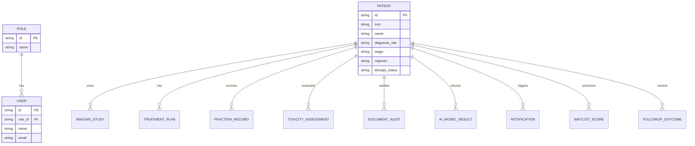

# OnkoAI RT Platform (Integrated Radiotherapy AI Web App)

Platform klinis/riset radioterapi berbasis AI dalam **1 aplikasi terpadu**, menghubungkan data pasien, imaging, planning, verifikasi setup, follow-up toksisitas, audit dokumen, outcome prediction, alert, dan analytics.

## 1) Arsitektur Aplikasi Lengkap

### High-level Architecture
- **Frontend (React + Vite + TypeScript + Tailwind + shadcn/ui style)**
  - Dashboard terpadu
  - Profil pasien 360°
  - Halaman modul AI per domain klinis
  - Alerts, workflow, reports, settings
- **Backend-ready boundary (future)**
  - REST/GraphQL API gateway
  - Auth service + RBAC policy
  - Clinical data service (patient/imaging/planning/fraction/follow-up)
  - AI inference orchestrator (model registry + async inference jobs)
  - Notification service
  - Reporting/export service (PDF/Excel)
- **Database (PostgreSQL)**
  - Entitas klinis dan hasil AI terpusat
- **Interoperability (future)**
  - DICOM/PACS connectors
  - OIS/TPS bridge
  - Document ingestion (RT-DocWatch)

### Clean Architecture Boundary (future-backend)
- `domain`: entitas + aturan klinis
- `application`: use-cases (run model, submit alert, audit docs)
- `infrastructure`: db repos, external AI clients, queues
- `interface`: HTTP controllers + DTO

---

## 2) Struktur Folder Proyek

```txt
src/
  components/
    layout/
      app-shell.tsx
    ui/
      badge.tsx
      button.tsx
      card.tsx
      ...
    radiotherapy-ui.tsx
  data/
    radiotherapy-dummy.ts
  pages/
    rt-dashboard-page.tsx
    rt-patients-page.tsx
    rt-patient-detail-page.tsx
    rt-workflow-page.tsx
    rt-modules-page.tsx
    rt-alerts-page.tsx
    rt-reports-page.tsx
    rt-settings-page.tsx
  types/
    radiotherapy.ts
  App.tsx
```

---

## 3) Desain Database / ERD (Conceptual)



---

## 4) Daftar Halaman & Komponen

### Halaman utama
- Dashboard
- Patients
- Patient Detail (profil terintegrasi)
- Clinical Workflow
- AI Modules (dynamic route untuk 10 modul)
- Alerts
- Reports
- Settings

### Komponen reusable
- `AppShell` (sidebar + content wrapper)
- `StatCard`
- `SeverityBadge`
- `Card`, `Button`, `Badge` UI primitives

---

## 5) Alur Data Antar Modul

1. CT-Sim masuk → **AutoContour-One** hasil segmentasi.
2. Target/OAR + constraints → **PlanPilot-VMAT** optimasi AI vs manual.
3. Fraksi harian CBCT/portal imaging → **Dose-Drift Detector** + **Setup-Error Zero**.
4. Follow-up serial:
   - Intraoral + dose map → **Mucositis-Cam**
   - CT radiomics + DVH paru → **PneumoShield**
   - Liver function + dose heterogeneity → **LiverRILD-Guard**
   - MRI radiomics + hippocampal dose → **Hippocampus-Saver AI**
5. Dokumen RT lintas sumber → **RT-DocWatch**.
6. Urgensi + kapasitas mesin + waktu tunggu → **WaitList-Fair**.
7. Semua output disimpan ke profil pasien dan dashboard departemen.

---

## 6) Contoh Dummy Data

Dummy data terpusat tersedia di:
- `src/data/radiotherapy-dummy.ts`

Mencakup:
- 5 role
- 3 pasien
- imaging studies (CT-Sim/CBCT/MRI/Intraoral)
- treatment plans & fractions
- toxicity + document audits
- hasil 10 modul AI
- notifications + waitlist score + follow-up outcomes

---

## 7) UI Dashboard Utama

Menampilkan:
- jumlah pasien aktif
- adaptive replanning alerts
- setup error alerts
- critical document/waiting list alerts
- aktivitas terbaru tiap modul AI
- tabel alert departemen

---

## 8) UI Patient Detail Terintegrasi

Pada halaman `/patients/:id`:
- Identitas + diagnosis + regimen
- Grid hasil 10 modul AI (severity + confidence + summary)
- Timeline imaging
- Toxicity assessments
- Document audit results

---

## 9) UI Tiap Modul AI

Halaman `/modules/:moduleKey` menyediakan:
- Navigasi 10 modul (AutoContour-One s.d. LiverRILD-Guard)
- Daftar input/output inferensi per pasien
- Severity, risk score, confidence, dan ringkasan interpretasi
- Basis untuk tombol simpan ke profil pasien

---

## 10) Kode Awal Siap Dikembangkan

Kode saat ini adalah **foundation frontend terintegrasi** dengan struktur data bersama untuk seluruh modul. Integrasi backend/inference dapat ditambahkan tanpa memecah aplikasi.

### Next Step (Recommended)
1. Tambahkan Express API (auth, patient CRUD, ai-results).
2. Gunakan PostgreSQL + Prisma migration untuk seluruh entitas.
3. Buat `inference-jobs` async queue (BullMQ/Redis).
4. Integrasikan ingestion DICOM/CBCT secara bertahap.
5. Tambahkan export PDF/Excel dari reports endpoint.

---

## Jalankan

```bash
npm install
npm run dev
npm run build
```
