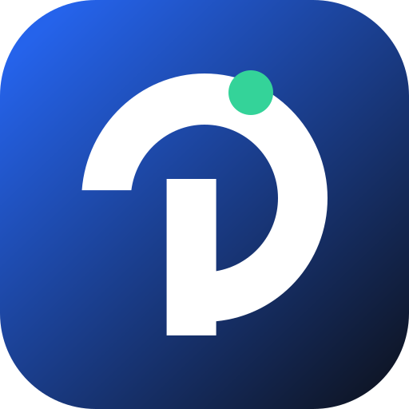

# Nusa-Onko

<p align="center">
  
</p>

<p align="center">
  <b>Platform simulasi AI Radioterapi berbasis React + TypeScript</b><br/>
  Untuk demo alur klinis: pasien → eksekusi modul → severity → notifikasi → histori & laporan.
</p>

---

## 📌 Tentang Proyek

**Nusa-Onko** adalah aplikasi web frontend untuk mensimulasikan operasional AI di domain radioterapi. Proyek ini sudah menyediakan:
- daftar pasien,
- dashboard operasional,
- eksekusi modul AI (rule-based/mock),
- pusat alert,
- serta laporan ringkas penggunaan.

Arsitekturnya dibuat agar mudah dikembangkan ke backend inferensi nyata (REST/Python service/model serving) tanpa mengubah pengalaman pengguna secara drastis.

---

## 🧠 Analisa Codebase (Detail & Mendalam)

### 1) Arsitektur Aplikasi

Aplikasi menggunakan **React + Vite + TypeScript** dengan pola state terpusat via Context (`RTStoreProvider`). Alur utama aplikasi:

1. User memilih pasien dan mengisi form input modul.
2. `runModule()` memanggil definisi modul pada `MODULE_MAP`.
3. Hasil skor + severity tersimpan sebagai execution history.
4. Jika severity `high`/`critical`, sistem membuat notifikasi otomatis.
5. Data dipakai ulang oleh Dashboard, Alerts, Patient Detail, dan Reports.

**Inti desain:**
- Pemisahan yang jelas antara **UI pages**, **store state**, dan **service logic** modul.
- Sangat cocok untuk MVP klinis karena bisa diuji end-to-end tanpa ketergantungan backend dulu.

### 2) Layer & Tanggung Jawab

- **UI Layer (`src/pages`, `src/components`)**
  Menangani rendering tampilan, interaksi pengguna, filtering, dan navigasi.
- **Domain/Service Layer (`src/services/module-definitions.ts`)**
  Menyimpan katalog 10 modul AI, field input, fitur, dan fungsi inferensi dummy.
- **State Layer (`src/lib/rt-store.tsx`)**
  Menjadi sumber data tunggal untuk pasien, execution history, notifikasi, dan fitur modul.
- **Data Seed (`src/data`)**
  Menyediakan data awal agar aplikasi langsung bisa dijalankan untuk demo/simulasi.

### 3) Modul AI yang Tersedia (10 Modul)

1. AUTOContour-One
2. DOSE-DRIFT DETECTOR
3. MUCOSITIS-CAM
4. PNEUMOSHIELD
5. PLANPILOT-VMAT
6. SETUP-ERROR ZERO
7. RT-DOCWATCH
8. HIPPOCAMPUS-SAVER AI
9. WAITLIST-FAIR
10. LIVERRILD-GUARD

Setiap modul memiliki:
- metadata (`key`, `name`, `purpose`),
- daftar fitur default,
- skema field input dinamis,
- fungsi `run(...)` untuk menghasilkan output terstruktur (`score`, `severity`, `summary`, `recommendation`, `output`).

### 4) Keunggulan Desain

- **Modular & scalable**: menambah modul baru cukup menambah 1 object definisi modul.
- **Konsisten severity model**: normalisasi severity (`low/moderate/high/critical`) memudahkan triase alert lintas modul.
- **Reusable UI**: komponen reusable mengurangi duplikasi page-level logic.
- **Mobile-aware UX**: tersedia komponen mobile top bar/bottom nav/action bar.

### 5) Area Pengembangan Lanjutan (Saran)

- Persistensi store ke API/database agar histori tidak hilang saat refresh.
- Authentication + role-based access (dokter/fisikawan/RTT/admin).
- Audit log & traceability untuk kebutuhan compliance klinis.
- Integrasi data DICOM/HL7/FHIR secara bertahap.
- Penguatan validasi numerik dan clinical guardrails per modul.

---

## ✨ Fitur Utama

- **Clinical Dashboard**
  - ringkasan pasien, modul aktif, alert kritis, aktivitas terbaru.
- **Patients Management (read-focused)**
  - pencarian pasien, filter risiko, quick metrics, detail per pasien.
- **Modules Overview**
  - pencarian modul, filter status, statistik run dan high alert.
- **Module Detail & Execution**
  - form dinamis sesuai modul,
  - validasi field wajib,
  - hasil analisis (score, severity, summary, recommendation),
  - histori eksekusi per modul.
- **Module Feature CRUD**
  - tambah fitur custom,
  - ubah status fitur (`planned/active/review/retired`),
  - catatan operasional,
  - reset default fitur.
- **Alerts Center**
  - agregasi notifikasi severity tinggi/kritis untuk review.
- **Reports / Profile**
  - distribusi severity, modul paling sering dipakai, coverage pasien.
- **Schema Database (Prisma)**
  - model pasien, eksekusi modul, hasil, notifikasi, toxicities, document audit, waitlist.

---

## 🧰 Tech Stack

- **Frontend**: React 18, TypeScript, Vite
- **Routing**: React Router DOM
- **Styling**: Tailwind CSS
- **UI Utility**: Radix UI, Lucide Icons, Sonner
- **Data Modeling**: Prisma Schema (PostgreSQL)

---

## 📂 Struktur Proyek

```bash
.
├── prisma/
│   └── schema.prisma
├── public/
├── src/
│   ├── components/
│   ├── data/
│   ├── lib/
│   ├── modules/
│   ├── pages/
│   ├── services/
│   ├── types/
│   ├── App.tsx
│   └── main.tsx
├── package.json
└── README.md
```

---

## 🚀 Instalasi & Menjalankan

### 1) Clone repository
```bash
git clone <url-repository-anda>
cd Nusa-Onko
```

### 2) Install dependencies
```bash
npm install
```

### 3) Jalankan mode development
```bash
npm run dev
```

### 4) Build production
```bash
npm run build
```

### 5) Preview build
```bash
npm run preview
```

---

## 🧪 Alur Penggunaan Cepat

1. Buka halaman **Patients** lalu pilih pasien.
2. Buka **Modules**, pilih salah satu modul AI.
3. Isi form input sesuai parameter klinis.
4. Klik **Run Analysis**.
5. Tinjau skor/severity/rekomendasi.
6. Cek dampaknya di **Alerts** dan **Reports**.

---

## ⚠️ Disclaimer

Proyek ini menggunakan **inferensi mock/rule-based** untuk kebutuhan simulasi, prototyping, dan edukasi alur kerja. 
**Bukan** alat diagnosis klinis final dan tidak boleh digunakan sebagai satu-satunya dasar keputusan medis.

---

## 👤 Author

**Lettu Kes dr. Muhammad Sobri Maulana, S.Kom, CEH, OSCP, OSCE**  
GitHub: [github.com/sobri3195](https://github.com/sobri3195)  
Email: [muhammadsobrimaulana31@gmail.com](mailto:muhammadsobrimaulana31@gmail.com)

---

## 🌐 Komunitas & Kanal Resmi

- YouTube: https://www.youtube.com/@muhammadsobrimaulana6013
- Telegram: https://t.me/winlin_exploit
- TikTok: https://www.tiktok.com/@dr.sobri
- Grup WhatsApp: https://chat.whatsapp.com/B8nwRZOBMo64GjTwdXV8Bl
- Website: https://muhammadsobrimaulana.netlify.app
- Halaman Personal: https://muhammad-sobri-maulana-kvr6a.sevalla.page/
- Toko Online Sobri: https://pegasus-shop.netlify.app
- Gumroad: https://maulanasobri.gumroad.com/

---

## 💝 Dukungan / Donasi

Jika proyek ini bermanfaat, Anda dapat mendukung melalui:

- Lynk: https://lynk.id/muhsobrimaulana
- Trakteer: https://trakteer.id/g9mkave5gauns962u07t
- KaryaKarsa: https://karyakarsa.com/muhammadsobrimaulana
- Nyawer: https://nyawer.co/MuhammadSobriMaulana

Terima kasih atas dukungannya 🙏

---

## 📄 Lisensi

Silakan sesuaikan lisensi proyek (MIT/Apache-2.0/dll) sesuai kebutuhan organisasi Anda.
